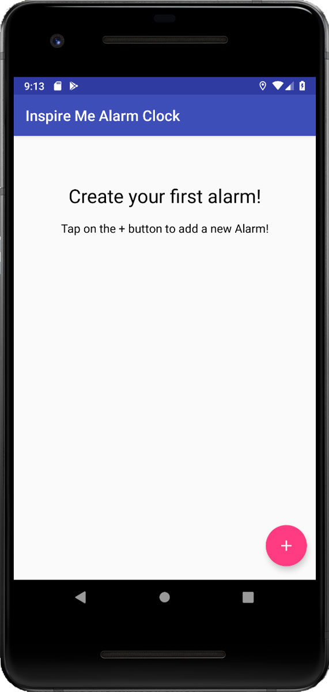
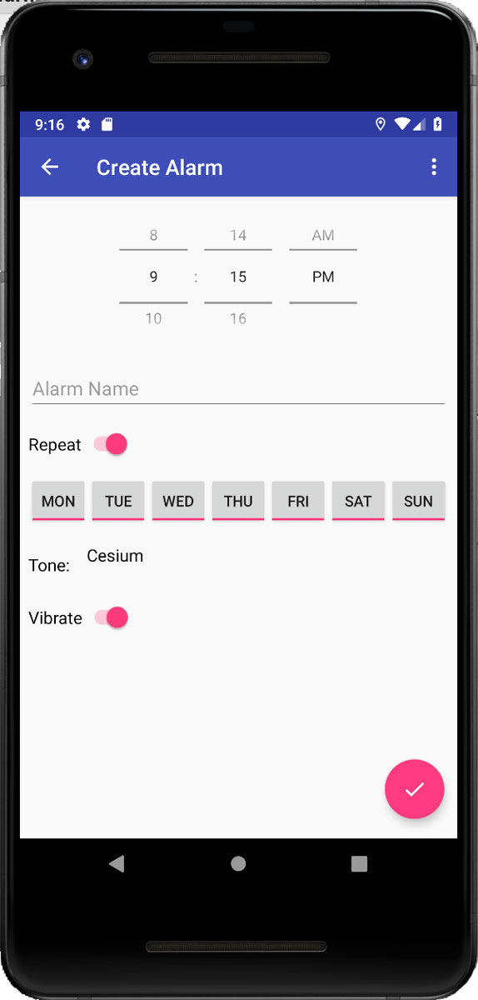
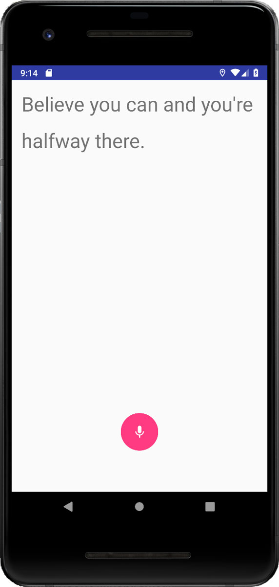

# Inspie Me Alarm Clock (Android App)
### Be inspired every morning (and awake)!

Android alarm clock application which will present the user with an inspirational quote which the user has to read out loud to turn off the alarm!

  
  
  

<!-- 

   -->

The most intresting part of the project is setting the broadcast reciver to capture the alarm. Therfore, even if the use close the alarm activity, still it will schedule another activity to check if the alarm is turned off using the challenge.

## Dependencies

* Firebase
* Retrofit
* Gson
* ButterKnife
* Room
* Espresso